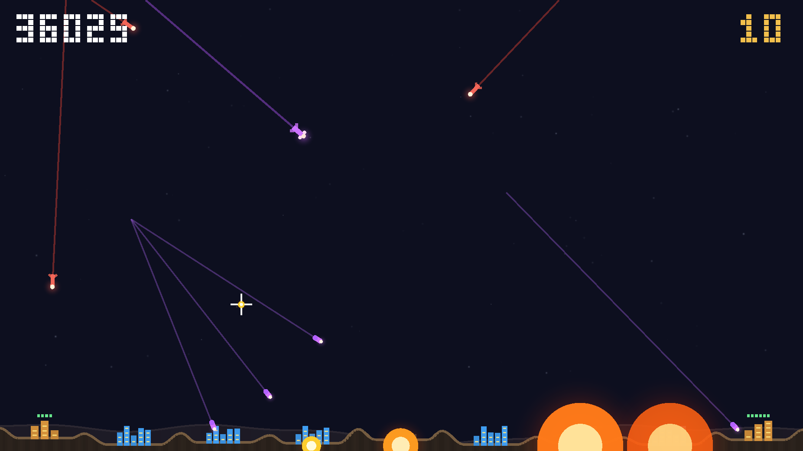
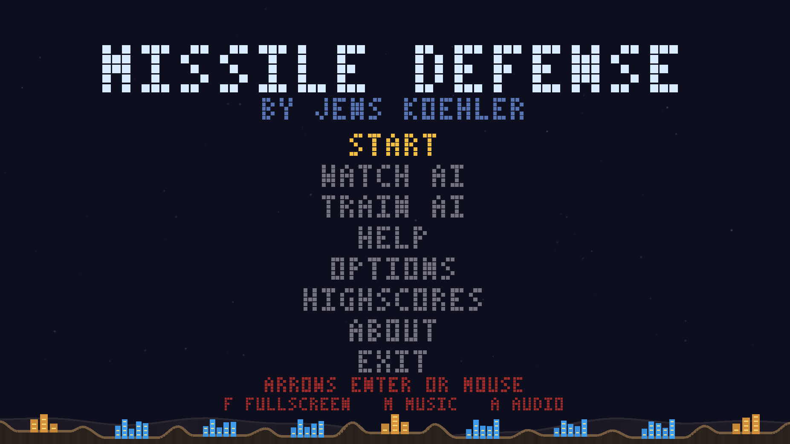
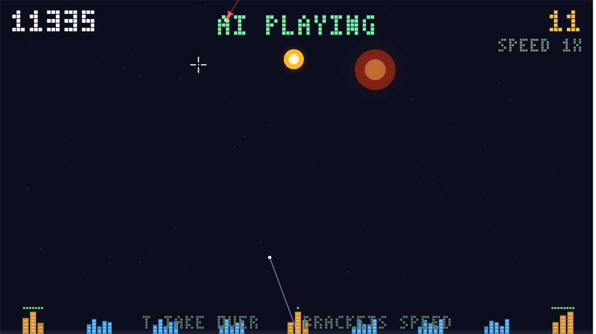
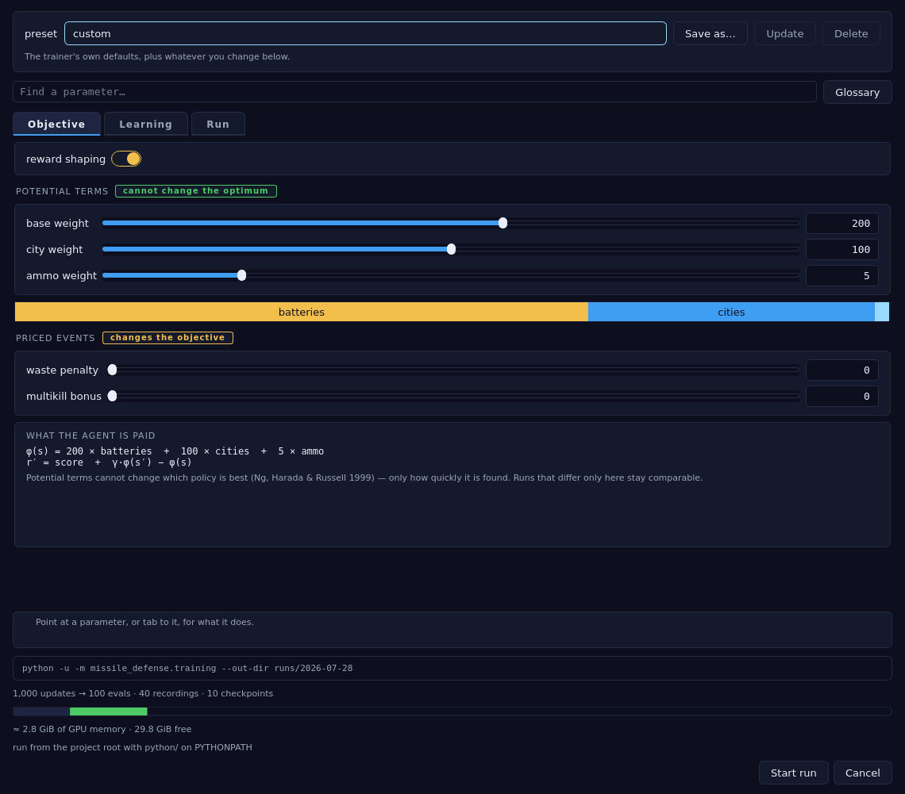

# Missile Defense

[](https://github.com/JensKSP/missile-defense/actions/workflows/ci.yml)
[](https://github.com/JensKSP/missile-defense/actions/workflows/nightly.yml)

A faithful clone of Atari's **Missile Command** (1980), built as a personal
project for learning AI / machine learning. The same deterministic C++
simulation is played by humans (Qt 6 + Vulkan) and — as a headless, fast,
reproducible environment — used to train a reinforcement-learning agent.

**CI** is the quality gate and every shipped artifact — the Linux gate (format,
lint, types, clang-tidy, coverage, both test suites), the application e2e suite,
and the game built on Linux, Windows and macOS. **Nightly** rebuilds `master`
and publishes the pre-release. A red badge means the tree is red; neither is
decorative.



*By Jens Köhler · [MIT License](LICENSE) · developed with [Claude Code](https://claude.com/claude-code) (Anthropic).*

## Download

Prebuilt for Ubuntu 26.04 LTS, Debian trixie, Ubuntu 24.04 LTS, Windows and
macOS (Apple silicon). Ubuntu 26.04 is the primary Linux target; the 24.04 game
package remains available for compatibility:

| | |
|---|---|
| **[Latest release](https://github.com/JensKSP/missile-defense/releases/latest)** | versioned, and someone has looked at it |
| [Nightly](https://github.com/JensKSP/missile-defense/releases/tag/nightly) | the newest `master` that passed CI; nobody has played it |

Every build is checksummed in `SHA256SUMS`. The macOS bundle is ad-hoc signed
rather than notarised, so macOS asks you to clear quarantine first —
[docs/MACOS.md](docs/MACOS.md#signing-it-for-other-people) has the one command.
How the versions are numbered, and what a nightly's `0.1.0~dev128` means to
`apt`, is in [docs/RELEASING.md](docs/RELEASING.md#versioning).

## System requirements

What a downloaded build needs. Building from source needs more — see
[Requirements](#requirements).

### To play the game

| | |
|---|---|
| **Debian / Ubuntu** | Ubuntu 26.04 LTS (primary), Debian 13 (trixie), or Ubuntu 24.04 LTS (game-only compatibility), 64-bit. Use the `.deb` named for your distribution; each is linked against that distribution's Qt and libstdc++. |
| **Windows** | Windows 10 or 11, 64-bit. |
| **macOS** | macOS 14 (Sonoma) or later, **Apple silicon only** — there is no Intel build. |
| **Graphics** | A GPU and driver that speak **Vulkan 1.0**. Anything from roughly 2016 on does: NVIDIA (any current driver), AMD, and Intel from Skylake. macOS has no Vulkan of its own and the bundle carries MoltenVK, so it goes through Metal. |
| **CPU** | Any x86-64 (or Apple silicon). No AVX-512, no special instruction set — releases are built for the baseline so they run everywhere. |
| **Memory / disk** | Well under 200 MB of RAM, and about 15 MB installed — half of that a pretrained model, so you can watch a learned agent play without training one. |
| **Sound** | Optional. Linux uses ALSA or PulseAudio if either is there and plays silently if not; there are no audio files to install, because every sound is generated in code. |

The game needs **no Python, no network, and no account**, and writes nothing
outside your home directory. Its SPIR-V shaders are compiled into the binary, so
apart from the pretrained model there is nothing beside it to lose.

> **If it does not start**, the likeliest cause by far is the graphics driver,
> and the game says so: it prints what Vulkan told it and what would fix it, in
> a dialog on Windows and macOS where there is no console to print to. On Linux
> `sudo apt install mesa-vulkan-drivers vulkan-tools` and then `vulkaninfo` is
> the whole diagnosis.

### To train your own agent

The trainer is a separate, optional product — a second package on
Debian, an unticked component in the Windows installer, a second icon in the
macOS disk image. Installing the game never brings any of it with it.

| | |
|---|---|
| **Python** | 3.11 or newer. Debian installs the trainer against the distribution's own; on Windows and macOS it follows whatever `python` is on your PATH, and tells you if there isn't one. |
| **PySide6** | Required (`apt install python3-pyside6.qtcharts`, or `pip install PySide6`). It is LGPL-3 where this project is MIT, which is why it is never a dependency of the game. |
| **PyTorch** | Required to *start* a run, not to watch or replay one. You do not have to install it yourself — the trainer offers to build a training runtime for the hardware it finds. |
| **GPU (optional)** | Training is optimizer-bound, so a GPU is the whole win: about **43× a 16-thread CPU** at the default 1024 environments, which needs ~4.1 GB of VRAM. NVIDIA (CUDA) or AMD (ROCm, Linux only). Without one it still trains, just slowly. |
| **Disk** | ~5 GB for a CUDA runtime, plus whatever your runs record. |
| **Network** | Only to install the training runtime. Nothing else phones anywhere. |

Details per platform: [docs/NVIDIA.md](docs/NVIDIA.md) ·
[docs/WAYLAND.md](docs/WAYLAND.md) · [docs/WINDOWS.md](docs/WINDOWS.md) ·
[docs/MACOS.md](docs/MACOS.md) · [docs/PACKAGING.md](docs/PACKAGING.md).

## Quick start

Or build it — clone to watching an AI defend six cities, in about ten minutes.
On Ubuntu 26.04 LTS or Debian 13 — for Ubuntu 24.04 see the compatibility note
below, for Windows see [docs/WINDOWS.md](docs/WINDOWS.md), for macOS
[docs/MACOS.md](docs/MACOS.md), and for other distros adjust the package names
using [Requirements](#requirements) below:

```bash
# 1 — dependencies (a few hundred MB: Qt 6, Vulkan, a C++23 compiler)
sudo apt update
sudo apt install -y g++ cmake ninja-build \
  qt6-base-dev qt6-base-dev-tools \
  libvulkan-dev glslang-tools mesa-vulkan-drivers libminiaudio-dev \
  nlohmann-json3-dev

# 2 — build (no Python needed anywhere in this)
git clone https://github.com/JensKSP/missile-defense.git
cd missile-defense
cmake --preset release && cmake --build --preset release

# 3 — install it, then play
sudo cmake --install build/release --component game
missile-defense
```

Step 3 puts the game in the prefix's `games/` directory — `/usr/local/games`,
which Debian and Ubuntu keep on the default PATH — along with a desktop entry, so
it is in your applications menu too. It is optional: `./build/release/app/md_app`
runs just as well from the build tree, and [a `.deb`](#packaging) is the version
your system can also uninstall.

> **The Ubuntu 24.04 compatibility note.** Noble's default `g++` is 13, whose
> libstdc++ has no C++23 `<print>`, so the build refuses it by name rather than
> failing deep in a header. 24.04 ships GCC 14 beside it, which is the whole fix:
>
> ```bash
> sudo apt install -y g++-14
> CXX=g++-14 cmake --preset release && cmake --build --preset release
> ```
>
> The game builds and plays there in full. The Python extension does not —
> `python3-nanobind` reached Debian after 24.04 froze — which is why the released
> 24.04 `.deb` is the game alone and the trainer is not offered on it
> ([docs/PACKAGING.md](docs/PACKAGING.md)).

**Play it.** The mouse aims, left click fires from the nearest battery with
ammo. Six cities, three batteries, and less ammunition than you would like.
→ [Full controls](#how-to-play)

**Watch the AI play it.** `missile-defense --watch` boots straight
into a game driven by the scripted agent — held to the same crosshair speed and
trigger interval and 15 Hz decision rate as your hand and a trained model. `]`
fast-forwards to 8×; `T` takes the controls back mid-game. On the held-out
canonical benchmark it averages **13,687** points and still loses every game
around wave 7, because this game is about spending ammunition, not about
aiming.
→ [More](#run-the-scripted-ai)

**Train one that beats it.** 13,687 is the number a learned policy has to beat.
Routine evaluation selects a checkpoint on 32 validation seeds; one final,
CPU-pinned score uses a different 32-seed held-out block and the same C++
summary code. → [docs/TRAINING.md](docs/TRAINING.md)

On **Windows** it is MSVC, CMake, Ninja, the Vulkan SDK and Qt — its own
ten-minute path is in [docs/WINDOWS.md](docs/WINDOWS.md). On **macOS** it is
Homebrew and MoltenVK:
[docs/MACOS.md](docs/MACOS.md), which is built and tested in CI but — unlike the
other two — has never been run by a human.

Deeper reading: [design & reward spec](docs/DESIGN.md) ·
[the agent API](docs/API.md) · [milestones / roadmap](docs/ROADMAP.md) ·
[what the two agents taught](docs/FINDINGS.md) ·
[testing & quality gate](docs/TESTING.md) ·
[simulation throughput](docs/PERFORMANCE.md) ·
[training on an NVIDIA GPU](docs/NVIDIA.md) ·
[multi-seed training runs](docs/MULTI_SEED.md) ·
[running on Wayland](docs/WAYLAND.md) ·
[packaging & file locations](docs/PACKAGING.md) ·
[release & versioning](docs/RELEASING.md)

## How to play

Defend your six cities from incoming missiles by launching interceptors from
your three batteries.

| Input | Action |
|---|---|
| Mouse | Move the crosshair (aim) |
| Left click | Queue one shot from the nearest battery for the next 15 Hz decision tick |
| Arrow keys / W,S + Enter | Navigate the menu (mouse works too — hover + click) |
| `Esc` or `P` | Pause → menu (resume with `Esc` or the RESUME item) |
| `F` | Toggle fullscreen |
| `M` | Toggle music |
| `A` | Toggle audio (SFX) |

Menu, in order: **START** a new game, **WATCH AI**, **TRAIN AI**, **HELP**,
**OPTIONS**, **HIGHSCORES**, **ABOUT**, **EXIT** — and **RESUME** at the top once
a game is under way, which is the only item starting a game adds (START becomes
**NEW GAME**). Nothing is ever removed, so no item moves between the main menu
and the pause menu. Beat a high score to enter your initials, arcade style.

**WATCH AI** always opens its own list: the three scripted rungs — **SCRIPTED
LOW**, **SCRIPTED MEDIUM**, **SCRIPTED HIGH** — plus **MODELS** where this
install has any learned ones. → [Run the scripted AI](#run-the-scripted-ai)

**OPTIONS** holds audio, music, fullscreen and **AI SKILL**, which is the rung
**WATCH AI** starts at.

**TRAIN AI** is always present, including on a game-only install. Where the
trainer is missing it offers to install it rather than hiding — on Windows and
macOS "not installed yet" is the ordinary state, and an absent menu entry meant
nobody discovered there was a trainer at all.
→ [AI training](#ai-training)

## Features

- **Faithful gameplay** — waves of ICBMs, splitting **MIRVs** (into re-entry
  warheads), blast-dodging **smart bombs**, three ammo-limited batteries, six
  destructible cities, bonus cities, and a rising difficulty curve.
- **Vulkan renderer** — instanced quads under an orthographic world→screen
  projection: rocket trails, glow, dangerous fireball explosions, distinct
  shapes per threat type, an animated twinkling starfield, and a pixel HUD/menu.
- **Procedural audio** — retro SFX *and* a looping FM-synth soundtrack, all
  generated in code (no asset files), driven by the core's deterministic event
  stream (whose complete decision-window counts are also observed by the AI).
- **Full arcade shell** — menu, pause, help, **options** (audio / music /
  fullscreen), and a persistent **top-10 highscore** table with arcade initials
  entry.
- **Train an agent, then play against your own** — a PPO trainer, a live
  trainer, and a **Model League**: promote a checkpoint and it is in
  the game's menu, running native C++ inference with no Python anywhere.
- **Models you can rank, not just run** — score any model over the canonical
  held-out seeds, put two of them head-to-head on identical seeds, then watch
  both episodes **side by side on one clock**. Export and import `.mdp` files to
  trade agents with somebody else.
- **Deterministic core** — fixed-timestep, `-ffp-contract=off`, seed + action
  replays are bit-identical (Debug == Release), gated by a golden checksum test.
- **Zero-warning, tested** — `-Werror`, strict clang-tidy, ruff + mypy, and
  ≥ 80 % core line coverage — all enforced by one `poe check` gate.

| | |
|:---:|:---:|
|  |  |
| **Full arcade shell** — menu, options, help, highscores | **Interceptors** — travel time, then an expanding blast |

## Requirements

Reference — the [quick start](#quick-start) above already covers the common
case. Read on for what each package is for and the optional development tools.

Built and tested on Debian (trixie); adjust package names for other distros.
**Windows** builds with MSVC and has its own instructions in
[docs/WINDOWS.md](docs/WINDOWS.md), and **macOS** through Homebrew in
[docs/MACOS.md](docs/MACOS.md).

### Required — to build and run the game

| Purpose | Packages |
|---|---|
| C++23 compiler | `g++` *(your system's own; see note below)* |
| Build system | `cmake` (≥ 3.25), `ninja-build` |
| GUI toolkit | `qt6-base-dev qt6-base-dev-tools` |
| Vulkan (dev + loader) | `libvulkan-dev` |
| Vulkan driver | `mesa-vulkan-drivers` *(or your GPU vendor's Vulkan driver)* |
| Shader compiler | `glslang-tools` (provides `glslangValidator`) |
| Audio (single-header) | `libminiaudio-dev` *(else fetched at build; see note)* |
| JSON (header-only) | `nlohmann-json3-dev` *(else fetched at build; see note)* |

The `apt install` line for exactly these is in the
[quick start](#quick-start) above, so there is only one copy to keep current.

> **Audio note:** miniaudio is a single-header library. The build prefers the
> system copy (`libminiaudio-dev`); if it is absent it fetches it via CMake
> (disable with `-DMD_FETCH_MINIAUDIO=OFF`). Nothing is vendored in-tree.

> **JSON note:** the same arrangement. `nlohmann/json` reads the `.mdp` policy
> manifest and the match manifest, so the *game* needs it now and not only the
> training half. The build prefers `nlohmann-json3-dev` and fetches it when that
> is absent — which works, but turns a package install into a source download,
> so it is listed above rather than left to the fallback.

> **Compiler note:** a build uses **the compiler your operating system already
> has** — GCC on Linux, Apple Clang on macOS, MSVC on Windows — and chooses
> nothing for you. That is what lets the quick start work on a machine nobody
> prepared, and it is the same path the `.deb` and the `pip install` wheel take,
> each wanting the toolchain of the system it is on.
> [CMakeLists.txt](CMakeLists.txt) states each floor and refuses an older one
> with a sentence rather than a page of template errors. `CXX=<compiler>` or
> `-DCMAKE_CXX_COMPILER=<compiler>` overrides all of it.
>
> **Development prefers Clang**, and only there: `clang-tidy`, the sanitizer
> builds and LLVM source-based coverage are what this project is measured with.
> The `debug`, `profile` and `coverage` presets ask for Clang on Linux (macOS is
> Clang already), so working on the code means installing `clang` — building and
> playing it does not.

### Optional — development, tests, and the task runner

| Purpose | Packages / tools |
|---|---|
| Task runner + Python tooling | `python3 python3-pip python3-venv` then `python3 -m tools.bootstrap` from the checkout |
| Vulkan validation (debugging) | `vulkan-validationlayers`, `vulkan-tools` (for `vulkaninfo`) |
| Development compiler | `clang` — what the `debug`, `profile` and `coverage` presets ask for |
| Editor tooling | `clangd clang-format clang-tidy` |
| Coverage | `llvm` (provides `llvm-cov`, `llvm-profdata`) |
| Debian package build | `cpack` (ships with `cmake`), `dpkg-dev` |
| Screenshot / video capture | `imagemagick` (`import`), `ffmpeg`, `xdotool` — on Linux/X11; Windows and macOS use what they ship with |

```bash
sudo apt install python3 python3-pip python3-venv \
  vulkan-validationlayers vulkan-tools \
  clang clangd clang-format clang-tidy llvm \
  dpkg-dev imagemagick ffmpeg xdotool
```

#### What the Python side installs, and where that is declared

There is deliberately no `requirements.txt`. One command sets the tree up —

```bash
python3 -m tools.bootstrap        # creates .venv and installs everything below
```

— and what it installs is declared in two places, each of which is the only copy:

| Group | Declared in | Contents |
|---|---|---|
| Package runtime | `pyproject.toml` → `dependencies` | `numpy` |
| The trainer | `pyproject.toml` → `[project.optional-dependencies].trainer` | PySide6, psutil, nvidia-ml-py, amdsmi (Linux) |
| Training | `pyproject.toml` → `[project.optional-dependencies].train` | torch — the extra a *user* installs; the venv gets its own copy below |
| Developer tools | `tools/bootstrap.py` → `DEV_TOOLS` | poethepoet, ruff, pytest, mypy, pyright, build |
| Build backend | `tools/bootstrap.py` → `BUILD_TOOLS` | nanobind |
| Gate pins | `tools/bootstrap.py` → `GATE_PINS` | numpy<2.5, pillow |
| Tests | `tools/bootstrap.py` → `TEST_TOOLS`, `TEST_INDEX` | torch, CPU wheel, from PyTorch's index |

A `requirements.txt` would be a third copy of those lists, and lists that are
copied drift — which is why `tools/bootstrap.py` reads the extras out of
`pyproject.toml` rather than restating them, and why `test_tools_bootstrap.py`
holds it to that.

#### torch, and the seventy-six tests that need it

Bootstrap installs torch as its own step — the **CPU** wheel, from PyTorch's
index — because 76 tests import it: 20 unit and 56 e2e. So a bootstrapped
checkout runs the whole suite:

```
659 passed          poe pytest      (639 passed, 20 skipped without torch)
                    poe test-app    135 tests, 56 of them needing torch
```

The step is allowed to fail. It is a large download from a second index, and a
machine that cannot reach it still gets a working checkout — one where those 76
skip and say why. That skip is correct on a machine with no torch and a lie on
this project's own, where torch is present but in the runtime the trainer
manages; CI installs it for the same reason.

Why the CPU wheel and not CUDA, why it can never become the one training uses,
and why torch is still shipped to nobody, are in
[docs/TESTING.md](docs/TESTING.md#torch-and-the-seventy-six-tests-that-need-it).

> **Tooling note:** the `poe` tasks take the first name they find on `PATH`,
> trying a version-suffixed binary before the plain one
> ([tools/quality.py](tools/quality.py), [tools/coverage.py](tools/coverage.py)),
> so your distribution's defaults are enough to work in the tree. The suffixed
> name is there because the CI gate pins one version deliberately: a check that
> judges the code has to judge it the same way twice, which is a stricter
> requirement than merely building.

## Build & run

### With CMake directly (no Python needed)

What the [quick start](#quick-start) uses:

```bash
cmake --preset release
cmake --build --preset release
sudo cmake --install build/release --component game
missile-defense
```

`--component game` is what keeps that install to the game: the binary as
`missile-defense` in the prefix's `games/` (on the default PATH for Debian and
Ubuntu), a desktop entry, icons, the bundled models and the licences — and not
the Python extension, which is a separate component and belongs in a wheel or a
`.deb` rather than loose under `/usr/local`.

The install is a convenience rather than a requirement. The binary has no data
files and its shaders are baked in, so `./build/release/app/md_app` runs
perfectly well straight from the build tree, and copying it somewhere works too
— what the install adds is the name on your PATH and an entry in the menu. For a
package your system can also *remove* again, see
[Packaging](#packaging).

### With `poe`

`poethepoet` wraps that same build together with the tests, linters, and
coverage gate behind one-word tasks — worth setting up as soon as you start
changing code:

```bash
python3 -m tools.bootstrap
source .venv/bin/activate

poe app        # build (Release) and launch the game
```

The bootstrap installs the development tools, trainer, CPU/RAM
monitor, and its NVIDIA and Linux Radeon telemetry bindings into that same
environment. PyTorch stays separate because its correct wheel depends on the
GPU and driver; follow [TRAINING.md](docs/TRAINING.md) when you want to train.

### Headless only

To build only the simulation + tests (no Qt/Vulkan):

```bash
cmake --preset release -DMD_BUILD_APP=OFF
cmake --build --preset release
```

### Starting from a clean tree

A fresh clone and a `git clean -ffdx` leave the same thing, and getting back from
either is two commands:

```bash
python3 -m tools.bootstrap        # rebuilds .venv and the development tools
cmake --preset release && cmake --build --preset release
```

Everything git ignores is reproducible **except two things**, which is worth
knowing before you clean:

| Path | Cost of losing it |
|---|---|
| `build/`, `.venv/`, caches | Time only — the commands above rebuild them. PyTorch is the long pole and is re-installed separately, per [docs/TRAINING.md](docs/TRAINING.md). |
| `runs/` | **Gone for good.** Training histories, several hundred MB, in no repository. |
| `models/<name>/`, `matches/` | **Gone for good.** Models the trainer promoted, and the match records between them. |

Bundled models are safe: `models/*.mdp` is tracked, and `.gitignore` ignores only
the per-model *directories* underneath. `git clean -ffdx` needs the second `-f`
because CMake checks dependencies out as nested git repositories under
`build/*/\_deps/`, and one `-f` skips those and leaves the tree half cleaned.

## AI training

The trainer puts the policy's real game score beside the scripted
agent's three skill levels — LOW, MEDIUM and HIGH — with the learning
diagnostics, recordings, model and hardware on the same screen:


It can start, pause, resume and stop a run without owning the training process;
close the window and training carries on. Runs are configured from named
**presets** — `fast` to check the machinery, `good` for the recipe that produced
the bundled model, `best` for an overnight bet — and you can save, update and
delete your own. A run that stopped is picked up with **Continue**, which fills
the form in from that run's own settings, and **Parameters…** shows what any run
was started with and which of those it changed. The full explanation of every
curve, file and control is in [docs/TRAINING.md](docs/TRAINING.md).

What comes out the far end is not a graph. A finished run is **promoted into the
[Model League](#put-your-model-in-the-game--the-model-league)** in one step,
which is the same step that installs it into the game: your agent, in the arcade
menu, playing the real thing.

### Set up your machine for AI training

From a checkout, install the development and trainer dependencies — which include
a CPU torch — then build the native Python binding:

```bash
python3 -m tools.bootstrap
source .venv/bin/activate
poe bindings
```

That torch is the *tests'* copy, and CPU training works everywhere it does. Do
not `pip install torch` over it for a real run: the venv copy is deliberately CPU
and is never what a training run gets. For a CUDA wheel that matches an NVIDIA
driver — without installing the CUDA toolkit — use the measured
[Debian/NVIDIA recipe](docs/NVIDIA.md); Windows has a separate
[native-Python path](docs/WINDOWS.md#the-python-half). An installed trainer
can set up its own managed PyTorch runtime from the **Set up training…** button
instead, which is the path that ends up being used on most machines.

### Run the scripted AI

**WATCH AI → SCRIPTED HIGH** hands the controls to the scripted baseline agent
(M4) and lets you watch it defend — same game, same crosshair travel, decision
rate and trigger interval a hand is held to, just a different driver. The same
three rungs are on the command line, and bare `--watch` means the published
baseline:

```bash
./build/release/app/md_app --watch                    # HIGH, the baseline
./build/release/app/md_app --watch-scripted medium    # or low / high
```

| Input | Action |
|---|---|
| `T` | Take over — you get the crosshair, the game continues from there |
| `]` / `[` | Fast-forward 1× → 8× (audio mutes above 1×) |
| `Esc` | Pause → menu |

Because both the simulation and the agent are deterministic, watching seed *N* is
bit-identical to the run `poe eval` measured for that seed — no recording needed,
the seed alone reproduces it.

### Run the pre-trained, packed model

**WATCH AI → MODELS → LEARNED HIGH** runs the bundled learned policy, natively.
There is no Python and no torch anywhere in that path: `models/learned-high.mdp`
is a data-only file ([docs/API.md](docs/API.md) §7) and `md::agent::Policy` reads
and evaluates it in C++, which is the entire reason the format exists.

It is the `policy-best.pt` of a 1,000-update relational run, selected on the
validation split and scored **once** on the held-out canonical block:
**23,067** against the scripted agent's 13,687. Two more rungs are bundled with
it — `learned-low` and `learned-medium` — so the menu offers a ladder rather
than one number.

The two implementations are held to agreeing exactly. `tools/make_policy_fixture.py`
writes a fixture whose logits, value and chosen action come from the Python
forward pass, and `agent/tests/unit/test_policy.cpp` asserts the C++ reader
reproduces them — including the case where the field is empty, which is where
the attention path can silently differ. End to end, the native evaluator
reproduces PyTorch's canonical run bin-for-bin, down to the kills-per-shot
histogram.

### Train your own model

Open the trainer and press **Start**, or run the same defaults in a terminal:

```bash
poe ui
poe train
```

The default is 1,024 parallel environments and 1,000 PPO updates. Evaluation
every 10 updates scores the policy on the fixed validation block and selects
`policy-best.pt`; it does not inspect the held-out **13,687** benchmark.
Recordings and checkpoints accumulate under `runs/`, while `policy-final.pt` is
the state to resume. After selection, `--load` runs the final canonical block
once at 15 Hz, a 120,000-tick cap and CPU inference. Start with
[the first-run walkthrough](docs/TRAINING.md#your-first-run) before changing
the knobs.

#### The knobs, and what they are asking you



There are thirty-seven of them, and they are not one list. They are three
questions, which is how the dialog is arranged:

| | |
|---|---|
| **Objective** | *What is the agent paid for?* The reward weights, and the equation they add up to. |
| **Learning** | *How does it learn?* Learning rate, discount, PPO's clip, the network. |
| **Run** | *How big, how long, what does it cost?* Environments, updates, and the schedule. |

A few things there are worth knowing before you drag anything:

* **The equation is live.** `φ(s) = 200 × batteries + 100 × cities + 5 × ammo`
  redraws as you move the weights, so what the agent will actually be paid is on
  screen while you decide it — not reconstructed afterwards from seven numbers.
* **The bar under the weights is the ratio**, which is the real decision: a
  battery is priced above a city on purpose, because protecting the guns is what
  protects the cities. The absolute numbers are a scale nobody reads.
* **Two of the reward terms are marked *changes the objective*.** The three
  potential weights provably cannot change which policy is best — only how fast
  it is found — so runs that differ only there stay comparable.
  `waste_penalty` and `multikill_bonus` are not potential terms, and a run that
  switches either on answers a different question from one that did not.
* **One discount, not two.** `PPOConfig.gamma` and `Shaping.gamma` must be
  equal or the invariance above does not hold, so there is a single control and
  it writes both flags.
* **Nothing is passed that you did not change.** The command line at the bottom
  is the run, and it reads as the difference from the defaults — you can copy it
  into a terminal and the trainer is not the only way in.

Every parameter carries the sentence written beside it in the trainer's own
source; point at one and the strip underneath explains it, its flag and its
default. **Parameters…** on a finished run opens the same dialog, read-only,
with the sliders sitting where that run left them.

### Put your model in the game — the Model League

A checkpoint is a file in a run directory; a **model** is something you keep,
play and compare. The trainer's **Model League** is where the second kind lives,
and getting there is three steps and about ten seconds:

1. select a run in the trainer's list — or open it — and press **Enter Model
   League…**;
2. take the checkpoint it offers — the best *evaluated* one that still exists on
   disk, which is often not the last, because PPO peaks and then regresses;
3. press **Promote**.

That is also the install step for the game. There is no export, no copy, no
path to remember: the league writes `models/<id>/policy.mdp` and the game reads
exactly that directory (`$MD_MODELS_DIR`, else a `models/` sibling of `runs/`),
so the model appears under **WATCH AI → MODELS** in the menu without restarting
anything — and it plays there **natively**, C++ inference against the real
simulation, with no Python running anywhere.

What promotion actually does is convert and prove. The `.pt` is exported to a
data-only `.mdp`, **read back, and validated before anything is written** — so a
checkpoint that cannot be loaded is refused at the moment you promote it rather
than at the moment you pick it from a menu. Both shipped architectures export:
`mlp` and the relational `entity` the bundled model uses
(`sim/export_policy.py` → `EXPORTABLE`). Anything else — a future architecture
with no native forward pass, or a checkpoint missing a tensor the format needs —
is refused the same way. Nothing half-written ever lands in the league.

Models are then yours to keep tidy. Every entry can be:

- **renamed** — the name is a label, never a path, so renaming breaks nothing;
- **deleted** — the only route out of the league, and therefore out of the
  game's menu, with what it costs stated before it happens;
- **exported** as a `.mdp` to hand to somebody else, and **imported** back —
  validated on the way in, because a downloaded file is exactly as trusted as a
  downloaded file;
- **replaced** — names are unique, so promoting `Anvil` a second time asks
  whether you mean *that* Anvil, and replacing swaps the weights in place rather
  than leaving two rows nobody can tell apart.

### Rank your models: canonical scores and head-to-head

**Evaluate** scores a model over the canonical held-out seeds — the one protocol
the table ranks on, stated in the dialog before it starts. A result measured any
other way is shown as `unranked` rather than mixed into the same column, because
a league table is worth exactly as much as the fairness of the numbers in it.

**Head-to-head…** takes two models and plays them over the *same* seeds, drawn
once and handed to both. Both run off the event loop with a progress bar and a
cancel, and nothing is recorded until a contest finishes.

Two mean scores tell you *which* model is better and nothing at all about *how* —
so a finished head-to-head offers to record one shared seed from each side and
open them in the game side by side, on one screen and one clock:

```bash
./build/release/app/md_app --match runs/matches/a-b/match.json
./build/release/app/md_app --match-left a.mdr --match-right b.mdr   # ad hoc
```

`Space` pauses, the arrows seek, `R` restarts, `Esc` returns — one transport,
both sides. Two recordings of *different* seeds are refused rather than shown:
two agents on two different problems side by side is not a comparison, and it
looks exactly like one.

**Wave sync** (`W`, on by default) keeps them on the same level. A faster agent
clears wave 4 while the other is still in it, and from that moment the two
halves are answering different problems — so whichever side reaches a new wave
first waits at the threshold, says so on screen, and both play the wave
together. Turn it off for the strict reading: same tick, same elapsed time,
whoever got further got further.

While a contest is still running you can also **watch it happen**. `Watch this
seed` opens the game on the seed being played at that moment — in a head-to-head
that is **both models side by side**, wave-synced, since half a comparison is
not what the button is for. It is a spectator, not a view: the game plays its
own copy of the episodes (everything here is deterministic, so they are the same
episodes tick for tick), and the contest neither waits for it nor notices it
close. `[` and `]` fast-forward up to 8x.

```bash
./build/release/app/md_app --watch-model models/amber-anvil/policy.mdp --seed 7240512240606951997
```

### Play a model you trained yourself

**MODELS** lists every policy this install can run: the bundled one, and
everything promoted into the league. Each row is the name out of the model's own
`.mdp`, never a filename, and no two rows share a name — the league refuses a
duplicate when it is promoted, and the menu falls back to the directory for
anything copied in by hand.

A model this build cannot run — one trained against an older observation, say —
is left out of the list and the reason printed, rather than offered and then
failing the moment you choose it. Any `.mdp` anywhere on disk can also be played
directly:

```bash
./build/release/app/md_app --watch-model models/amber-anvil/policy.mdp
```

### Watch replays

Name a recording and the game plays it back:

```bash
./build/release/app/md_app --replay runs/update-01000.mdr
```

A *learned* policy is not reproducible from a seed the way the scripted agent is, so
training runs record episodes instead — from Python, `env.record(0)` then
`env.save_recording(0, path, update=n, label=f"update-{n}")`. What is stored is the
action index per agent step, four bytes each, so the episodes a run leaves behind
weigh 4–40 kB and can be dropped every few updates to watch the policy improve.

| Input | Action |
|---|---|
| `[` / `]` | Fast-forward 1x -> 8x |
| Left / Right | Seek back / forward 5 s |
| `R` | Restart the recording |
| `T` | Take over from where it has reached |

### Pick how well the scripted agent plays

**OPTIONS → AI SKILL** sets the rung **WATCH AI** starts at. On the command line
the game spells it `--watch-scripted low|medium|high`; the headless evaluator,
which is what produced the table below, uses `--skill`:

```bash
./build/release/agent/md_agent_eval --skill medium
```

The three are defined by *behaviours switched off*, not by tuned magic numbers,
so what each one costs is attributable. Measured on the canonical block:

| Skill | Mean score | Wave | Kills/shot | Wasted shots |
|---|---|---|---|---|
| LOW | 5,024 | 5.16 | 0.33 | 71% |
| MEDIUM | 8,296 | 6.22 | 0.49 | 57% |
| **HIGH** (the baseline) | **13,687** | 7.16 | 0.73 | 36% |

`Params::coverage_horizon` is the dial: **how many seconds ahead the agent
remembers the shots it has already fired**. At HIGH it tracks every interceptor
in flight and never fires twice at a warhead that is already dead; at LOW it
tracks none and wastes over two thirds of its ammunition. That one behaviour is
the ladder's entire spread — 8,663 of HIGH's 13,687.

### What it taught: the handicap decides who wins

Both agents, same simulation, same held-out block, both handicapped: the scripted
agent scores **13,687** and the learned policy **23,067**. The learned one wins
on *depth* while still losing on *marksmanship* — it reaches wave 8.91 against
7.16, and gets there by firing more and hitting less often (0.61 kills per
interceptor against 0.73).

Take the handicap away and the result reverses. Given an agent that never
mis-clicks and never waits, the geometry *is* the game and the hand-written
solution wins comfortably. So the conclusion is narrower than "write the
algorithm" and more useful: **where a good algorithmic solution exists it wins
exactly as far as its preconditions hold** — and a closed-form aimer's
precondition is a perfect hand.

The full argument, the retired unhandicapped numbers, what the scripted agent's
one good idea is worth, and the hybrid this repository is set up to try next:
→ **[docs/FINDINGS.md](docs/FINDINGS.md)**

## Development

```bash
poe test        # C++ unit + e2e tests (Debug)
poe coverage    # md::core line coverage; fails under 80% (currently ~96%)
poe check       # full local gate: format, lint, types, tidy, tests, coverage
```

The project enforces a **zero-warning** policy (`-Werror`, clang-tidy as errors,
ruff, mypy) plus a **≥ 80 % coverage** gate on the core. See
[docs/TESTING.md](docs/TESTING.md).

Handy tasks: `poe build`, `poe test-unit`, `poe test-release`, `poe shot`
(screenshot the running app), `poe rec` (record video), `poe format`, `poe ui`
(start, watch and stop a training run — see [docs/TRAINING.md](docs/TRAINING.md)).

## Packaging

There are **two products and therefore two Debian packages**, and one wheel.

| | What it is | How it is built |
|---|---|---|
| `missile-defense` | The game. Qt 6 + Vulkan, MIT, no Python anywhere. | `poe deb`, or debhelper |
| `missile-defense-trainer` | The trainer. Pulls in PySide6 (LGPL-3), which is why it is not part of the game. | debhelper only |
| `missile_defense-*.whl` | The environment + training half, for `pip`. | cibuildwheel, in CI |

### The game `.deb`, from the CMake build

```bash
poe deb         # -> build/release/missile-defense_<version>_<arch>.deb
sudo apt install ./build/release/missile-defense_*.deb   # installs `missile-defense`
```

This is CPack's DEB generator over the `game` install component: the game at
`/usr/games/missile-defense` with a desktop entry and its runtime dependencies
(Qt 6, the Vulkan loader) declared. It is the quick one, and it is **only the
game** — CPack has a single component here, by design.

### Both packages, the way a release builds them

The released `.deb`s come from `debian/` via debhelper, not from CPack, because
the claim they make is "the package this distribution would build" and only
`dpkg-buildpackage` can make it:

```bash
sudo apt build-dep .          # or: mk-build-deps --install debian/control
dpkg-buildpackage -us -uc -b  # -> ../missile-defense{,-trainer}_<version>_<arch>.deb
```

Per-distribution filenames, what each leg builds, and why Ubuntu 24.04 produces
the game alone are in [docs/RELEASING.md](docs/RELEASING.md#what-comes-out) and
[docs/PACKAGING.md](docs/PACKAGING.md).

### The wheel

The Python half — the environment, PPO and the trainer — installs with `pip` and
needs no Qt and no checkout. CI builds it with cibuildwheel and attaches it to
each [release](https://github.com/JensKSP/missile-defense/releases/latest);
**it is not on PyPI**, so install the file:

```bash
pip install ./missile_defense-<version>-<tag>.whl
pip install "./missile_defense-<version>-<tag>.whl[trainer]"   # + the trainer window
```

From a checkout, `pip install .` builds the same thing from source —
scikit-build-core compiles the extension, so the
[build requirements](#requirements) apply.

Either way it brings two commands with it — `missile-defense-train` to run PPO
from a terminal (`--multiseed` for
[several independent seeds](docs/MULTI_SEED.md)), and `missile-defense-trainer`
to open the trainer. Both are named after the product rather than the import
package, so the only name a user was ever shown is the one they type. On Windows
and macOS this same wheel is what the game's **TRAIN AI** installs for you.

## Project layout

| Path | Contents |
|---|---|
| `core/` | Pure C++ simulation library (`md::core`) + tests — no Qt, no rendering |
| `agent/` | The scripted baseline agent, the native `.mdp` policy reader, and `md_agent_eval` |
| `replay/` | The `.mdr` recording format — writer, reader, and its golden tests |
| `app/` | Qt 6 + Vulkan human client (renderer, input, HUD, menu, highscores) |
| `bindings/` | nanobind vector environment and shared evaluation bindings |
| `python/` | The `missile_defense` package: NumPy environment wrapper, PPO, run management, trainer |
| `tools/` | Cross-platform Python dev tooling (bootstrap, coverage, format/tidy, capture) |
| `bench/` | Throughput benchmark (`poe bench`) |
| `models/` | The bundled `.mdp` policies the game ships with |
| `debian/`, `packaging/` | Debian source package, and the platform installer inputs |
| `docs/` | Design spec, roadmap, findings, testing, training, packaging, per-platform notes |

## License & credits

Copyright © 2026 Jens Köhler. Released under the [MIT License](LICENSE).

This game was designed and written by Jens Köhler and **developed with
[Claude Code](https://claude.com/claude-code)** (Anthropic) as an AI pair
programmer. *Missile Command* is a trademark of Atari; this is an independent,
non-commercial homage.

The project is MIT, but a release redistributes other people's work too. Every
dependency, its licence, and what each one obliges are listed in
**[THIRD_PARTY_LICENSES.md](THIRD_PARTY_LICENSES.md)** — the short version:

- **[Qt 6](https://www.qt.io/)** is **LGPL-3.0-only** and carries a required
  notice. It is *dynamically linked*, never modified, so you can replace it with
  your own build of the same version — which is the condition that lets an MIT
  game ship against it.
- **[miniaudio](https://miniaud.io/)** (public domain / MIT-0) and
  **[nlohmann/json](https://json.nlohmann.me/)** (MIT) are compiled in, from the
  system package or a CMake fetch. Nothing is vendored in-tree.
- **[nanobind](https://github.com/wjakob/nanobind)** (BSD-3-Clause) builds the
  Python extension.
- **[PySide6](https://doc.qt.io/qtforpython/)** is LGPL-3.0 and is *depended on,
  never redistributed* — which is the whole reason the trainer is a separate
  package that the game does not pull in.
