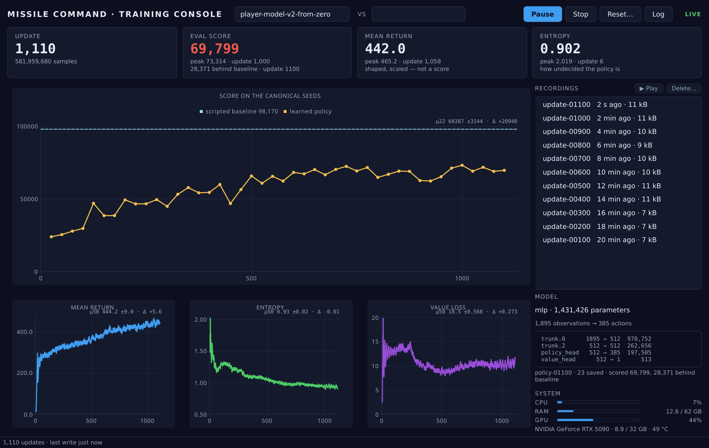
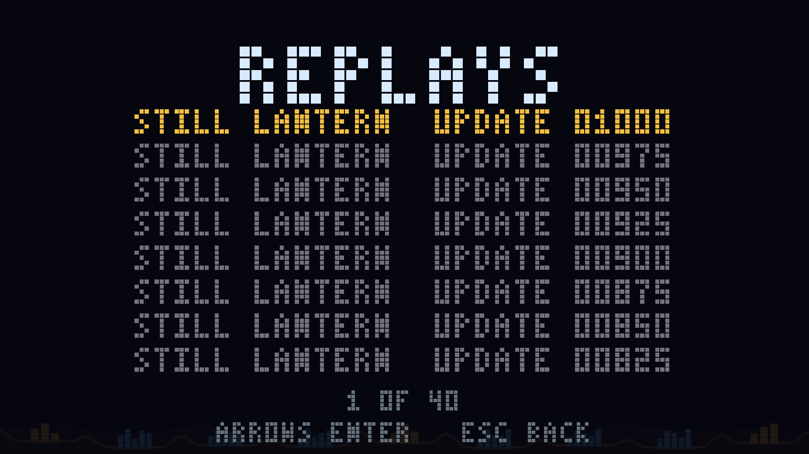

# Missile Defense

A faithful clone of Atari's **Missile Command** (1980), built as a personal
project for learning AI / machine learning. The same deterministic C++
simulation is played by humans (Qt 6 + Vulkan) and — as a headless, fast,
reproducible environment — used to train a reinforcement-learning agent.


*By Jens Köhler · [MIT License](LICENSE) · developed with [Claude Code](https://claude.com/claude-code) (Anthropic).*

## Download

Prebuilt for Ubuntu 26.04 LTS, Debian trixie, Ubuntu 24.04 LTS, Windows and
macOS (Apple silicon). Ubuntu 26.04 is the primary Linux target; the 24.04 game
package remains available for compatibility:

| | |
|---|---|
| **[Latest release](https://github.com/JensKSP/missile-defense/releases/latest)** | versioned, and someone has looked at it |
| [Nightly](https://github.com/JensKSP/missile-defense/releases/tag/nightly) | the newest `master` that passed CI; nobody has played it |

Every build is checksummed in `SHA256SUMS`. The macOS bundle is ad-hoc signed
rather than notarised, so macOS asks you to clear quarantine first —
[docs/MACOS.md](docs/MACOS.md#signing-it-for-other-people) has the one command.
How the versions are numbered, and what a nightly's `0.1.0~dev128` means to
`apt`, is in [docs/RELEASING.md](docs/RELEASING.md#versioning).

## System requirements

What a downloaded build needs. Building from source needs more — see
[Requirements](#requirements).

### To play the game

| | |
|---|---|
| **Debian / Ubuntu** | Ubuntu 26.04 LTS (primary), Debian 13 (trixie), or Ubuntu 24.04 LTS (game-only compatibility), 64-bit. Use the `.deb` named for your distribution; each is linked against that distribution's Qt and libstdc++. |
| **Windows** | Windows 10 or 11, 64-bit. |
| **macOS** | macOS 14 (Sonoma) or later, **Apple silicon only** — there is no Intel build. |
| **Graphics** | A GPU and driver that speak **Vulkan 1.0**. Anything from roughly 2016 on does: NVIDIA (any current driver), AMD, and Intel from Skylake. macOS has no Vulkan of its own and the bundle carries MoltenVK, so it goes through Metal. |
| **CPU** | Any x86-64 (or Apple silicon). No AVX-512, no special instruction set — releases are built for the baseline so they run everywhere. |
| **Memory / disk** | Well under 200 MB of RAM, and about 15 MB installed — half of that a pretrained model, so you can watch a learned agent play without training one. |
| **Sound** | Optional. Linux uses ALSA or PulseAudio if either is there and plays silently if not; there are no audio files to install, because every sound is generated in code. |

The game needs **no Python, no network, and no account**, and writes nothing
outside your home directory. Its SPIR-V shaders are compiled into the binary, so
apart from the pretrained model there is nothing beside it to lose.

> **If it does not start**, the likeliest cause by far is the graphics driver,
> and the game says so: it prints what Vulkan told it and what would fix it, in
> a dialog on Windows and macOS where there is no console to print to. On Linux
> `sudo apt install mesa-vulkan-drivers vulkan-tools` and then `vulkaninfo` is
> the whole diagnosis.

### To train your own agent

The training console is a separate, optional product — a second package on
Debian, an unticked component in the Windows installer, a second icon in the
macOS disk image. Installing the game never brings any of it with it.

| | |
|---|---|
| **Python** | 3.11 or newer. Debian installs the console against the distribution's own; on Windows and macOS it follows whatever `python` is on your PATH, and tells you if there isn't one. |
| **PySide6** | Required (`apt install python3-pyside6.qtcharts`, or `pip install PySide6`). It is LGPL-3 where this project is MIT, which is why it is never a dependency of the game. |
| **PyTorch** | Required to *start* a run, not to watch or replay one. You do not have to install it yourself — the console offers to build a training runtime for the hardware it finds. |
| **GPU (optional)** | Training is optimizer-bound, so a GPU is the whole win: about **43× a 16-thread CPU** at the default 1024 environments, which needs ~4.1 GB of VRAM. NVIDIA (CUDA) or AMD (ROCm, Linux only). Without one it still trains, just slowly. |
| **Disk** | ~5 GB for a CUDA runtime, plus whatever your runs record. |
| **Network** | Only to install the training runtime. Nothing else phones anywhere. |

Details per platform: [docs/NVIDIA.md](docs/NVIDIA.md) ·
[docs/WINDOWS.md](docs/WINDOWS.md) · [docs/MACOS.md](docs/MACOS.md) ·
[docs/PACKAGING.md](docs/PACKAGING.md).

## Quick start

Or build it — clone to watching an AI defend six cities, in about ten minutes.
On Ubuntu 26.04 LTS or Debian 13 — for Ubuntu 24.04 see the compatibility note
below, for Windows see [docs/WINDOWS.md](docs/WINDOWS.md), for macOS
[docs/MACOS.md](docs/MACOS.md), and for other distros adjust the package names
using [Requirements](#requirements) below:

```bash
# 1 — dependencies (a few hundred MB: Qt 6, Vulkan, a C++23 compiler)
sudo apt update
sudo apt install -y g++ cmake ninja-build \
  qt6-base-dev qt6-base-dev-tools \
  libvulkan-dev glslang-tools mesa-vulkan-drivers libminiaudio-dev \
  nlohmann-json3-dev

# 2 — build (no Python needed, and no install step afterwards)
git clone https://github.com/JensKSP/missile-defense.git
cd missile-defense
CXX=g++ cmake --preset release && cmake --build --preset release

# 3 — play
./build/release/app/md_app
```

Ubuntu 24.04 remains supported, but its default g++-13 lacks C++23 `<print>`.
There, install `g++-14` instead of `g++` and configure with
`CXX=g++-14 cmake --preset release`.

**Play it.** The mouse aims, left click fires from the nearest battery with
ammo. Six cities, three batteries, and less ammunition than you would like.
→ [Full controls](#how-to-play)

**Watch the AI play it.** `./build/release/app/md_app --watch` boots straight
into a game driven by the scripted agent — held to the same crosshair speed and
trigger interval and 15 Hz decision rate as your hand and a trained model. `]`
fast-forwards to 8×; `T` takes the controls back mid-game. On the held-out
canonical benchmark it averages **98,542** points and still loses every game
around wave 16, because this game is about spending ammunition, not about
aiming.
→ [More](#run-the-scripted-ai)

**Train one that beats it.** 98,542 is the number a learned policy has to beat.
Routine evaluation selects a checkpoint on 32 validation seeds; one final,
CPU-pinned score uses a different 32-seed held-out block and the same C++
summary code. → [docs/TRAINING.md](docs/TRAINING.md)

On **Windows** the same toolchain runs under MSYS2 — its own ten-minute path is
in [docs/WINDOWS.md](docs/WINDOWS.md). On **macOS** it is Homebrew and MoltenVK:
[docs/MACOS.md](docs/MACOS.md), which is built and tested in CI but — unlike the
other two — has never been run by a human.

Deeper reading: [design & reward spec](docs/DESIGN.md) ·
[the agent API](docs/API.md) · [milestones / roadmap](docs/ROADMAP.md) ·
[testing & quality gate](docs/TESTING.md) ·
[simulation throughput](docs/PERFORMANCE.md) ·
[training on an NVIDIA GPU](docs/NVIDIA.md) ·
[packaging & file locations](docs/PACKAGING.md)

## Features

- **Faithful gameplay** — waves of ICBMs, splitting **MIRVs** (into re-entry
  warheads), blast-dodging **smart bombs**, three ammo-limited batteries, six
  destructible cities, bonus cities, and a rising difficulty curve.
- **Vulkan renderer** — instanced quads under an orthographic world→screen
  projection: rocket trails, glow, dangerous fireball explosions, distinct
  shapes per threat type, an animated twinkling starfield, and a pixel HUD/menu.
- **Procedural audio** — retro SFX *and* a looping FM-synth soundtrack, all
  generated in code (no asset files), driven by the core's deterministic event
  stream (whose complete decision-window counts are also observed by the AI).
- **Full arcade shell** — menu, pause, help, **options** (audio / music /
  fullscreen), and a persistent **top-10 highscore** table with arcade initials
  entry.
- **Deterministic core** — fixed-timestep, `-ffp-contract=off`, seed + action
  replays are bit-identical (Debug == Release), gated by a golden checksum test.
- **Zero-warning, tested** — `-Werror`, strict clang-tidy, ruff + mypy, and
  ≥ 80 % core line coverage — all enforced by one `poe check` gate.

| | |
|:---:|:---:|
|  |  |
| **Full arcade shell** — menu, replays, options, help, highscores | **Interceptors** — travel time, then an expanding blast |

## Requirements

Reference — the [quick start](#quick-start) above already covers the common
case. Read on for what each package is for and the optional development tools.

Built and tested on Debian (trixie); adjust package names for other distros.
**Windows** builds through MSYS2 with its own instructions in
[docs/WINDOWS.md](docs/WINDOWS.md), and **macOS** through Homebrew in
[docs/MACOS.md](docs/MACOS.md).

### Required — to build and run the game

| Purpose | Packages |
|---|---|
| C++23 compiler | `clang-21 lld-21` *(or any C++23 compiler — see note below)* |
| Build system | `cmake` (≥ 3.25), `ninja-build` |
| GUI toolkit | `qt6-base-dev qt6-base-dev-tools` |
| Vulkan (dev + loader) | `libvulkan-dev` |
| Vulkan driver | `mesa-vulkan-drivers` *(or your GPU vendor's Vulkan driver)* |
| Shader compiler | `glslang-tools` (provides `glslangValidator`) |
| Audio (single-header) | `libminiaudio-dev` *(else fetched at build; see note)* |
| JSON (header-only) | `nlohmann-json3-dev` *(else fetched at build; see note)* |

The `apt install` line for exactly these is in the
[quick start](#quick-start) above, so there is only one copy to keep current.

> **Audio note:** miniaudio is a single-header library. The build prefers the
> system copy (`libminiaudio-dev`); if it is absent it fetches it via CMake
> (disable with `-DMD_FETCH_MINIAUDIO=OFF`). Nothing is vendored in-tree.

> **JSON note:** the same arrangement. `nlohmann/json` reads the `.mdp` policy
> manifest and the match manifest, so the *game* needs it now and not only the
> training half. The build prefers `nlohmann-json3-dev` and fetches it when that
> is absent — which works, but turns a package install into a source download,
> so it is listed above rather than left to the fallback.

> **Compiler note:** the CMake preset pins **clang-21** (Debian package). To use
> a different compiler, edit `CMakePresets.json` (the `CMAKE_CXX_COMPILER` cache
> variable) or pass `-DCMAKE_CXX_COMPILER=<your-c++23-compiler>`.

### Optional — development, tests, and the task runner

| Purpose | Packages / tools |
|---|---|
| Task runner + Python tooling | `python3 python3-pip python3-venv` then `python3 -m tools.bootstrap` from the checkout |
| Vulkan validation (debugging) | `vulkan-validationlayers`, `vulkan-tools` (for `vulkaninfo`) |
| Editor tooling | `clangd-21 clang-format-21 clang-tidy-21` |
| Coverage | `llvm-21` (provides `llvm-cov-21`, `llvm-profdata-21`) |
| Debian package build | `cpack` (ships with `cmake`), `dpkg-dev` |
| Screenshot / video capture | `imagemagick` (`import`), `ffmpeg`, `xdotool` — on Linux/X11; Windows and macOS use what they ship with |

```bash
sudo apt install python3 python3-pip python3-venv \
  vulkan-validationlayers vulkan-tools \
  clangd-21 clang-format-21 clang-tidy-21 llvm-21 \
  dpkg-dev imagemagick ffmpeg xdotool
```

## Build & run

### With CMake directly (no Python needed)

What the [quick start](#quick-start) uses:

```bash
cmake --preset release
cmake --build --preset release
./build/release/app/md_app
```

There is no system install step — run the game from the build output above (or
copy `build/release/app/md_app` wherever you like; it has no data files, shaders
are baked into the binary).

### With `poe`

`poethepoet` wraps that same build together with the tests, linters, and
coverage gate behind one-word tasks — worth setting up as soon as you start
changing code:

```bash
python3 -m tools.bootstrap
source .venv/bin/activate

poe app        # build (Release) and launch the game
```

The bootstrap installs the development tools, training console, CPU/RAM
monitor, and its NVIDIA and Linux Radeon telemetry bindings into that same
environment. PyTorch stays separate because its correct wheel depends on the
GPU and driver; follow [TRAINING.md](docs/TRAINING.md) when you want to train.

### Headless only

To build only the simulation + tests (no Qt/Vulkan):

```bash
cmake --preset release -DMD_BUILD_APP=OFF
cmake --build --preset release
```

## How to play

Defend your six cities from incoming missiles by launching interceptors from
your three batteries.

| Input | Action |
|---|---|
| Mouse | Move the crosshair (aim) |
| Left click | Queue one shot from the nearest battery for the next 15 Hz decision tick |
| Arrow keys / W,S + Enter | Navigate the menu (mouse works too — hover + click) |
| `Esc` | Pause → menu (resume with `Esc` or the RESUME item) |
| `P` | Pause → menu |
| `F` | Toggle fullscreen |
| `M` | Toggle music |
| `A` | Toggle audio (SFX) |

Menu: **START** a new game, **WATCH AI**, **REPLAYS**, **HELP**, **OPTIONS**
(audio / music / fullscreen), **HIGHSCORES**, **ABOUT**, **EXIT**. Beat a high
score to enter your initials, arcade style.

## AI training

The training console puts the policy's real game score beside the scripted
agent's three skill levels — LOW, MEDIUM and HIGH — with the learning
diagnostics, recordings, model and hardware on the same screen:



It can start, pause, resume and stop a run without owning the training process;
close the window and training carries on. Runs are configured from named
**presets** — `fast` to check the machinery, `good` for the recipe that produced
the bundled model, `best` for an overnight bet — and you can save, update and
delete your own. A run that stopped is picked up with **Continue**, which fills
the form in from that run's own settings, and **Parameters…** shows what any run
was started with and which of those it changed. The full explanation of every
curve, file and control is in [docs/TRAINING.md](docs/TRAINING.md).

### Set up your machine for AI training

From a checkout, install the development and console dependencies, then PyTorch
and the native Python binding:

```bash
python3 -m tools.bootstrap
source .venv/bin/activate
python -m pip install torch
poe bindings
```

CPU training works everywhere PyTorch does. For a CUDA wheel that matches an
NVIDIA driver — without installing the CUDA toolkit — use the measured
[Debian/NVIDIA recipe](docs/NVIDIA.md); Windows has a separate
[native-Python path](docs/WINDOWS.md#training-on-windows). An installed training
console can set up its own managed PyTorch runtime from the **Set up training…**
button instead.

### Run the scripted AI

**WATCH AI** hands the controls to the scripted baseline agent (M4) and lets you
watch it defend — same game, same crosshair travel, decision rate and trigger
interval a hand is held to, just a different driver:

```bash
./build/release/app/md_app --watch
```

| Input | Action |
|---|---|
| `T` | Take over — you get the crosshair, the game continues from there |
| `]` / `[` | Fast-forward 1× → 8× (audio mutes above 1×) |
| `Esc` | Pause → menu |

Because both the simulation and the agent are deterministic, watching seed *N* is
bit-identical to the run `poe eval` measured for that seed — no recording needed,
the seed alone reproduces it.

### Run the pre-trained, packed model

**WATCH AI → MODELS → RELATIONAL 620** runs the bundled learned policy, natively. There
is no Python and no torch anywhere in that path: `models/pretrained.mdp` is a
data-only file ([docs/API.md](docs/API.md) §7) and `md::agent::Policy` reads and
evaluates it in C++, which is the entire reason the format exists.

It is the `policy-best.pt` of a 1,000-update relational run, selected on the
validation split and scored **once** on the held-out canonical block:
**90,866** against the scripted agent's 98,542.

The two implementations are held to agreeing exactly. `tools/make_policy_fixture.py`
writes a fixture whose logits, value and chosen action come from the Python
forward pass, and `agent/tests/unit/test_policy.cpp` asserts the C++ reader
reproduces them — including the case where the field is empty, which is where
the attention path can silently differ. End to end, the native evaluator
reproduces PyTorch's canonical run bin-for-bin, down to the kills-per-shot
histogram.

### Train your own model

Open the console and press **Start**, or run the same defaults in a terminal:

```bash
poe ui
poe train
```

The default is 1,024 parallel environments and 1,000 PPO updates. Evaluation
every 10 updates scores the policy on the fixed validation block and selects
`policy-best.pt`; it does not inspect the held-out **98,542** benchmark.
Recordings and checkpoints accumulate under `runs/`, while `policy-final.pt` is
the state to resume. After selection, `--load` runs the final canonical block
once at 15 Hz, a 120,000-tick cap and CPU inference. Start with
[the first-run walkthrough](docs/TRAINING.md#your-first-run) before changing
the knobs.

### Run your own model in the game

Direct live inference in the C++ game is not implemented yet. Score the best
checkpoint through Python and record an episode, then play that recording in the
game:

```bash
poe train -- --load runs/checkpoints/policy-best.pt --record-to runs/mine.mdr
./build/release/app/md_app --replay runs/mine.mdr
```

The recording contains the policy's actions, so playback uses the real
deterministic simulation and renderer rather than a video. You can take over
with `T` at any point.

### Play a model you trained yourself

**MODELS** lists every policy this install can run: the bundled one, and
everything the console has promoted into the Model League. Promotion *is* the
install step — the game reads the same directory the console writes
(`$MD_MODELS_DIR`, else a `models/` sibling of the runs directory), so a model
you promote is playable from the menu without restarting anything.

Each row is the name out of the model's own `.mdp`, never a filename. A model
this build cannot run — one trained against an older observation, say — is left
out of the list and the reason printed, rather than offered and then failing the
moment you choose it.

### Watch two models play the same seed, side by side

The Model League's **Head-to-head…** plays two models over the same seeds,
records one episode from each, and opens them on one screen and one clock:

```bash
./build/release/app/md_app --match runs/matches/a-b/match.json
./build/release/app/md_app --match-left a.mdr --match-right b.mdr   # ad hoc
```

`Space` pauses, the arrows seek, `R` restarts, `Esc` returns — one transport,
both sides, always on the same tick. Two recordings of *different* seeds are
refused rather than shown: two agents on two different problems side by side is
not a comparison, and it looks exactly like one.

### Watch replays

Pick one from the **REPLAYS** menu entry, which lists the recordings in `runs/`
— both the ones sitting directly in it and the ones inside each managed run —
newest first:



Or name one directly:

```bash
./build/release/app/md_app --replay runs/update-01000.mdr
```

A *learned* policy is not reproducible from a seed the way the scripted agent is, so
training runs record episodes instead — from Python, `env.record(0)` then
`env.save_recording(0, path, update=n, label=f"update-{n}")`. What is stored is the
action index per agent step, four bytes each, so the episodes a run leaves behind
weigh 4–40 kB and can be dropped every few updates to watch the policy improve.

| Input | Action |
|---|---|
| `[` / `]` | Fast-forward 1x -> 8x |
| Left / Right | Seek back / forward 5 s |
| `R` | Restart the recording |
| `T` | Take over from where it has reached |

### What it taught: if you can write the algorithm, write it

The scripted agent is a few hundred lines of geometry. The learned one is PPO
with a relational attention network over threats, interceptors and blasts — a
1,959-float observation, 385 actions, an hour on an RTX 5090. On the same
held-out block the scripted agent scores **98,542** and the learned policy
scores **90,866**. The interesting part is not the gap but its *shape*:

| | Scripted | Learned |
|---|---|---|
| Mean wave reached | 15.75 | 15.38 |
| Kills per interceptor | **1.09** | **0.86** |
| Wasted shots | **4%** | **23%** |

**It matched the depth and lost on marksmanship.** That is not bad luck. Putting
a blast where a warhead is going to be is a closed-form intercept problem: a
human writes it once, exactly, and it is right in every wave from the first to
the sixteenth. A network has to recover the same geometry from a scalar reward —
a spectacularly indirect way to learn ballistics — and it never quite does.

The skill ladder above sharpens the point rather than softening it. The scripted
agent's entire advantage turned out to be *one* idea — remember which warheads
you have already fired at — worth 78,000 of its 98,542 points. The learned
policy, given no hint that such an idea exists, rediscovered enough of it to
reach wave 15 and not enough to stop wasting a quarter of its ammunition. It
landed between MEDIUM and HIGH: better than an agent with a third of a second of
memory, worse than one with a perfect one.

So the conclusion this project arrived at is the unfashionable one: **where a
good algorithmic solution exists, write it.** Learning should earn its keep on
the part with no closed form — allocation under a fixed ammunition budget — and
on this evidence it has not won there either.

Two things stop that from being the whole story. The learned policy got within a
few percent with **no game-specific knowledge at all** — nobody told it what a
MIRV is, or that ammunition is scarce — and it would retrain unchanged against a
game whose wave table or weapons you altered, where the scripted agent would
have to be rewritten by hand. And the strongest version of this system is
probably neither one alone: a scripted aimer under a learned allocator, each
owning the half it is actually good at. That is the experiment this repository
is now set up to run and has not run yet.

### Pick how well the scripted agent plays

**OPTIONS → AI SKILL** cycles the scripted agent between three settings, and
`--skill` does the same from the command line:

```bash
./build/release/agent/md_agent_eval --skill medium
```

The three are defined by *behaviours switched off*, not by tuned magic numbers,
so what each one costs is attributable. Measured on the canonical block:

| Skill | Mean score | Wave | Kills/shot | Wasted shots |
|---|---|---|---|---|
| LOW | 19,586 | 8.4 | 0.50 | 56% |
| MEDIUM | 63,296 | 13.2 | 0.75 | 33% |
| **HIGH** (the baseline) | **98,542** | 15.8 | 1.09 | 4% |

`Params::coverage_horizon` is the dial: **how many seconds ahead the agent
remembers the shots it has already fired**. At HIGH it tracks every interceptor
in flight and never fires twice at a warhead that is already dead; at LOW it
tracks none and wastes over half its ammunition.

Two things fell out of measuring this that are worth knowing before you tune it.
The response is a **cliff, not a slope** — 0.30 s scores ~34k and 0.40 s ~85k,
because that is where the dial crosses a typical interceptor's flight time and
the agent either remembers a shot before it lands or does not. And the
sophisticated-looking part of the agent is worth almost nothing: switching off
`cluster_bonus`, which deliberately waits for MIRV spreads to converge, costs
about **1,500 points**, while ammunition memory is worth about **78,000**. The
whole scripted baseline is one idea — *do not shoot what is already dead*.

## Development

```bash
poe test        # C++ unit + e2e tests (Debug)
poe coverage    # md::core line coverage; fails under 80% (currently ~96%)
poe check       # full local gate: format, lint, types, tidy, tests, coverage
```

The project enforces a **zero-warning** policy (`-Werror`, clang-tidy as errors,
ruff, mypy) plus a **≥ 80 % coverage** gate on the core. See
[docs/TESTING.md](docs/TESTING.md).

Handy tasks: `poe build`, `poe test-unit`, `poe test-release`, `poe shot`
(screenshot the running app), `poe rec` (record video), `poe format`, `poe ui`
(start, watch and stop a training run — see [docs/TRAINING.md](docs/TRAINING.md)).

## Building a Debian package

```bash
poe deb         # -> build/release/missile-defense_<version>_<arch>.deb
sudo apt install ./build/release/missile-defense_*.deb   # installs `missile-defense`
```

The package installs the game to `/usr/games/missile-defense` with a desktop
entry, and declares its runtime dependencies (Qt 6, the Vulkan loader). It is
produced by CPack's DEB generator directly from the CMake build.

## Project layout

| Path | Contents |
|---|---|
| `core/` | Pure C++ simulation library (`md::core`) + tests — no Qt, no rendering |
| `app/` | Qt 6 + Vulkan human client (renderer, input, HUD, menu) |
| `bindings/` | nanobind vector environment and shared evaluation bindings |
| `python/` | NumPy environment wrapper, PPO training/evaluation, and training console |
| `docs/` | Design spec, roadmap, testing, training, Windows + macOS notes |
| `tools/` | Cross-platform Python dev tooling (coverage, format/tidy, capture) |

## License & credits

Copyright © 2026 Jens Köhler. Released under the [MIT License](LICENSE).

This game was designed and written by Jens Köhler and **developed with
[Claude Code](https://claude.com/claude-code)** (Anthropic) as an AI pair
programmer. Audio uses [miniaudio](https://miniaud.io/) (public domain / MIT-0)
via the system package or CMake fetch — nothing is vendored. *Missile Command*
is a trademark of Atari; this is an independent, non-commercial homage.
